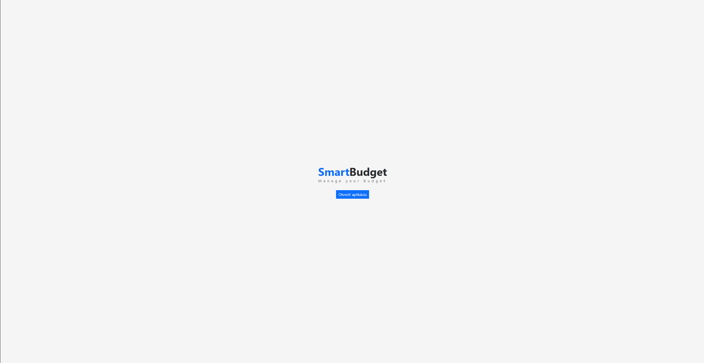

# SmartBudget
Web application for managing your budget. Covering: PHP, Laravel, Intertia.js, ReactJS

### Changelog
- added functionality and page with signing in with email and password
- added functionality and page with creating an account
- added functionality and page with sending url for resetting password via email
- added functionality and page with setting up a new password 

###  In progress
- sidebar with budget sheets, short monthly overview and information about current user

